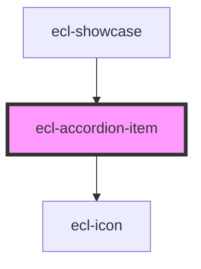

# ecl-accordion-item

<!-- Auto Generated Below -->

## Properties

| Property     | Attribute     | Description | Type      | Default     |
| ------------ | ------------- | ----------- | --------- | ----------- |
| `isExpanded` | `is-expanded` |             | `boolean` | `false`     |
| `label`      | `label`       |             | `string`  | `undefined` |
| `styleClass` | `style-class` |             | `string`  | `undefined` |

## Dependencies

### Used by

 - [ecl-showcase](../ecl-showcase)

### Depends on

- [ecl-icon](../ecl-icon)

### Graph

----------------------------------------------

*Built with [StencilJS](https://stenciljs.com/)*
