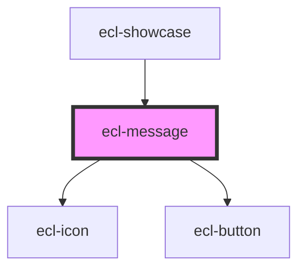

# ecl-message

<!-- Auto Generated Below -->

## Properties

| Property     | Attribute     | Description | Type     | Default     |
| ------------ | ------------- | ----------- | -------- | ----------- |
| `styleClass` | `style-class` |             | `string` | `undefined` |
| `title`      | `title`       |             | `string` | `undefined` |
| `typeClass`  | `type-class`  |             | `string` | `'info'`    |

## Dependencies

### Used by

 - [ecl-showcase](../ecl-showcase)

### Depends on

- [ecl-icon](../ecl-icon)
- [ecl-button](../ecl-button)

### Graph

----------------------------------------------

*Built with [StencilJS](https://stenciljs.com/)*
