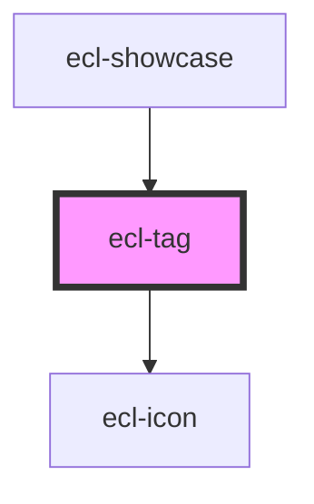

# ecl-tag

<!-- Auto Generated Below -->

## Properties

| Property      | Attribute      | Description | Type      | Default     |
| ------------- | -------------- | ----------- | --------- | ----------- |
| `isRemovable` | `is-removable` |             | `boolean` | `undefined` |
| `styleClass`  | `style-class`  |             | `string`  | `undefined` |

## Dependencies

### Used by

 - [ecl-showcase](../ecl-showcase)

### Depends on

- [ecl-icon](../ecl-icon)

### Graph

----------------------------------------------

*Built with [StencilJS](https://stenciljs.com/)*
